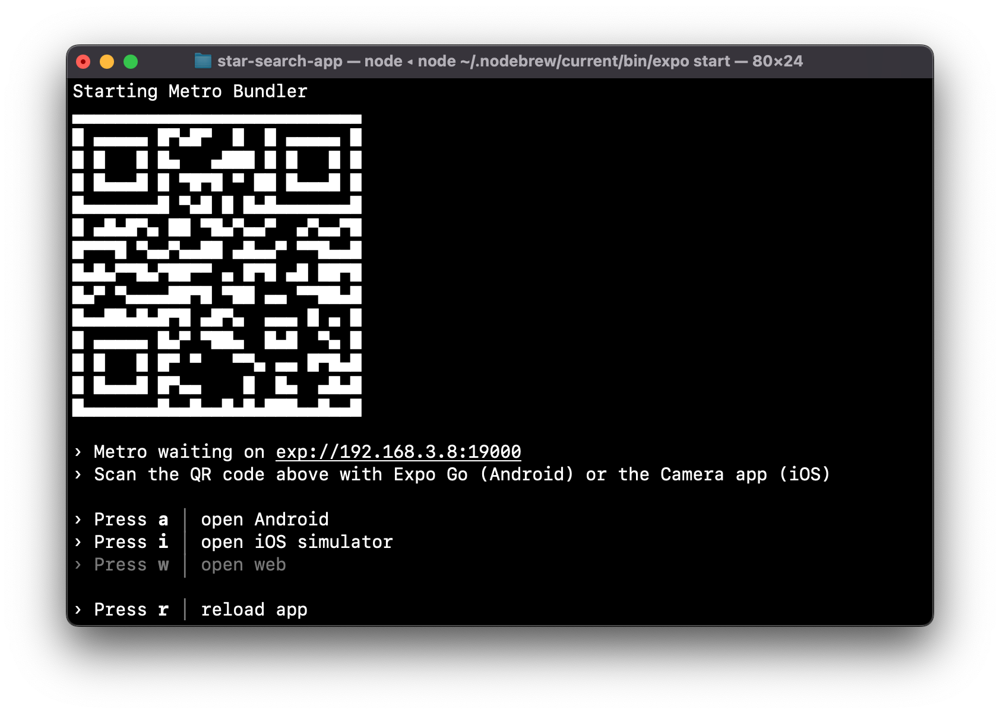

---
hide:
  - toc
---
# <i class="fa fa-arrow-circle-right" aria-hidden="true"></i> アプリ実行
## 1. Expo起動

!!! Warning

     `~/star_search_app`で実行
            
```
$ npx expo start
```

- QRコードが表示されることを確認する

