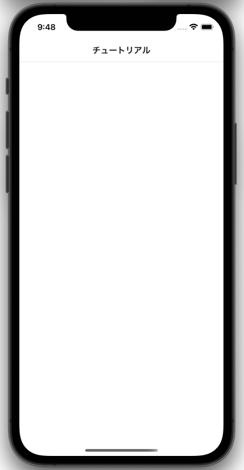

---
hide:
  - toc
---
# <i class="fa fa-arrow-circle-right" aria-hidden="true"></i> アプリ実行
## 2. アプリ起動

- iOSの方
    - スマホのカメラでQRコードを読み取る
- Androidの方
    - Expo SDK52以降の場合
        - DevClient版をインストール後、スマホのカメラでQRコードを読み取る
    - Expo SDK51以前の場合
        - Expo GOのアプリから `Scan QR code` を選択
- 以下の画面が表示される
  
     </img>

!!! Warning

     Windowsの方で起動しない場合は次の 「3. ポート解放」を参照
     
     起動した方は「アプリ実行」は以上です
