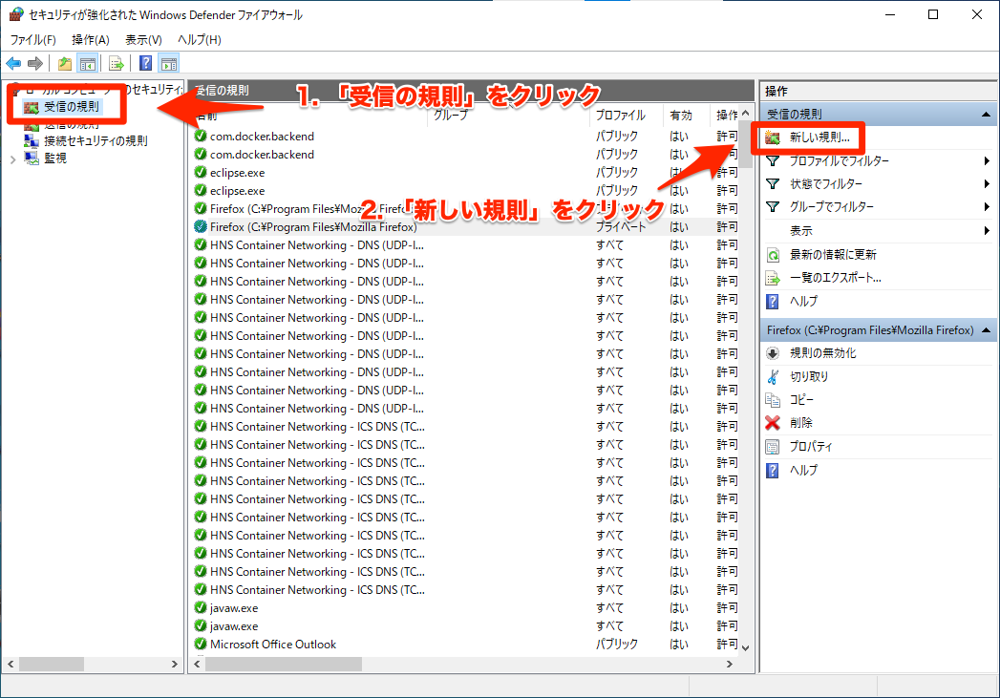

---
hide:
  - toc
---
# <i class="fa fa-arrow-circle-right" aria-hidden="true"></i> アプリ実行

## 3. ポート解放

1.windowの左下から検索
  
</img>

2.「詳細設定」を選択
  
</img>

3.「新しい規則」を選択
  
</img>

4.「ポート」を選択
  
</img>

5.「19000」を入力 ※Expoのポートを確認
  
</img>

6.接続を許可する
  
</img>

7.全てチェック
  
</img>

8.規則作成
  
</img>

9.「送信の規則」でも同じ手順を行う
  
</img>

10.「受信の規則」で作成されていることを確認
  
</img>

11.「送信の規則」で作成されていることを確認
  
</img>

!!! Warning

     それでもできない場合は次のステップに進む