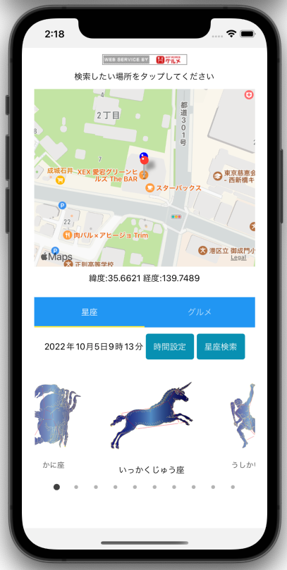
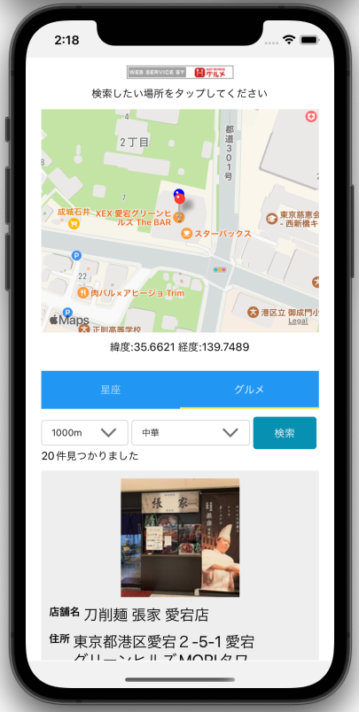

---
hide:
  - toc
---
# <i class="fa fa-arrow-circle-right" aria-hidden="true"></i> 簡単なアプリを作ってみよう

- アプリ完成画面
  
</img>
</img>

## 仕様
- マップ機能を使用して、星座、店舗情報を取得するアプリを作成してもらいます。
- 利用するAPI
    - [星をみるひと API](https://hoshimiru.docs.apiary.io/#)
        - 指定した座標から見える星座情報を取得するために使用します。
    - [ホットペッパー API](https://webservice.recruit.co.jp/doc/hotpepper/reference.html)
        - 指定した座標から、店舗情報を取得するために使用します。

!!!Note
    APIとはプログラム同士をつなぐ「インターフェース」のことです

    ソフトウェアにAPIという「**外部とやりとりができる窓口**」を作り、外部アプリ(サービス)とコミュニケーションや連携ができるようになります

