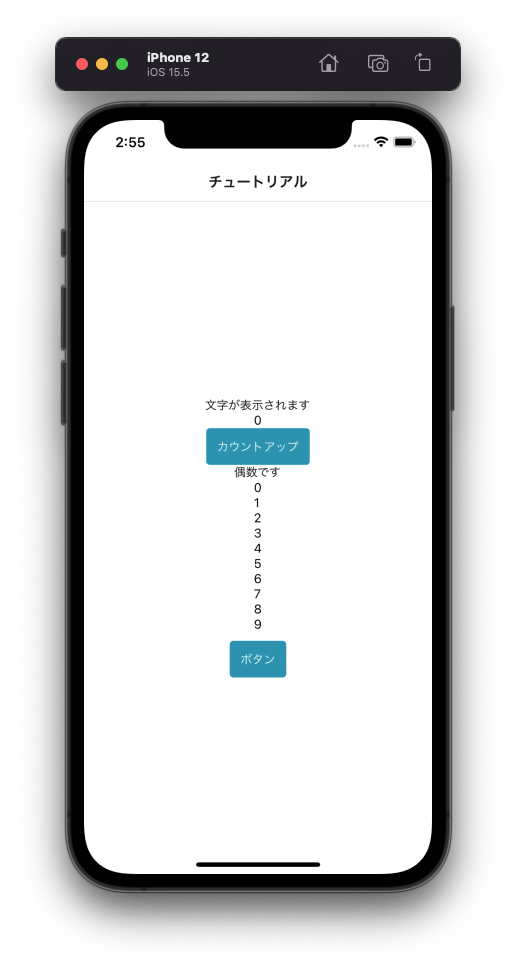
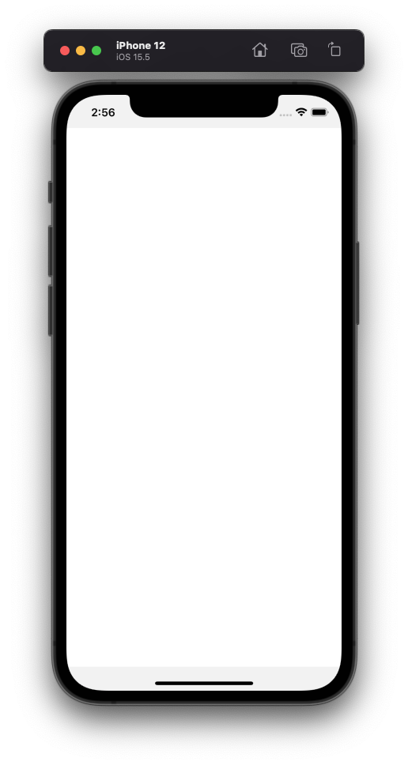

---
hide:
  - toc
---
# <i class="fa fa-arrow-circle-right" aria-hidden="true"></i> 簡単なアプリを作ってみよう

## 1. 画面を移動してみよう

- 94行辺り: 最初の``{/*``と 最後の``*/}`` を削除してください

        <Button onPress={() => navigation.navigate('Home')} style={{marginTop:10}}>ボタン</Button>

</img>
</img>

