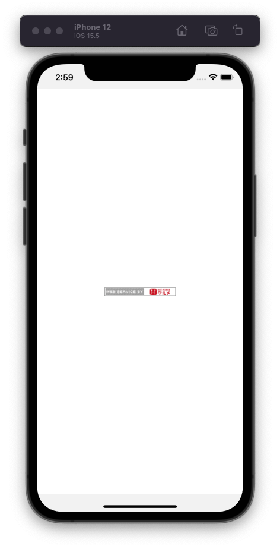

---
hide:
  - toc
---
# <i class="fa fa-arrow-circle-right" aria-hidden="true"></i> 簡単なアプリを作ってみよう

## 3. 画像を表示してみよう
   
- 7行辺り: ``{/* 3-1 */}``	← この下にコードを追加してください

        import ImageView from '../components/atoms/ImageView';

- 23行辺り: ``{/* 3-2 */}``	← この下にコードを追加してください

        <TouchableHighlight
            onPress={() =>
                Linking.openURL('http://webservice.recruit.co.jp/')
            }
            style={{margin:10}}
        >
            {/* 画像表示 */}
            <ImageView width={135} height={17} uri={'http://webservice.recruit.co.jp/banner/hotpepper-s.gif'}/>
        </TouchableHighlight>

</img>
