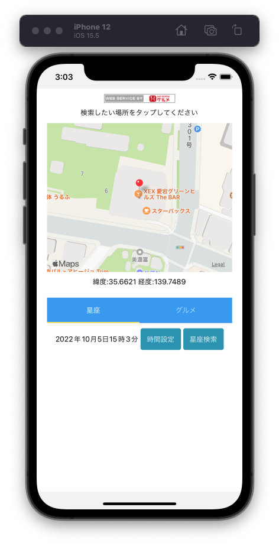

---
hide:
  - toc
---
# <i class="fa fa-arrow-circle-right" aria-hidden="true"></i> 簡単なアプリを作ってみよう

## 6. 完成品サンプル

        import React, { useState, useEffect } from 'react';
        import { NativeBaseProvider} from 'native-base';
        import { StyleSheet, Text, View, TouchableHighlight, Linking, SafeAreaView, Platform, StatusBar } from 'react-native';
        import MapView from 'react-native-maps';

        // コンポーネント読み込み
        {/* 3-1 */}
        import ImageView from '../components/atoms/ImageView';

        {/* 4-1 */}
        import {getLocationAsync} from '../util/Common'

        {/* 5-1 */}
        import ContentsTab from '../components/Molecules/tab/ContentsTab';

        const Home = () => {

            {/* 4-2 */}
            // 赤ピンの緯度
            const [latitude, setLatitude] = useState(0);
            // 赤ピンの経度
            const [longitude, setLongitude] = useState(0);
            // マップ中心部の緯度
            const [showLatitude, setShowLatitude] = useState(0);
            // マップ中心部の経度
            const [showLongitude, setShowLongitude] = useState(0);
            // 検索した店舗情報
            const [shopList, setShopList] = useState([])

            //　マップに表示する赤ピンの座標を変更
            const changePosition = (p) => {

                // 赤ピンの座標を変更
                setLatitude(p.latitude)
                setLongitude(p.longitude)

                // マップの中心を赤ピンの位置に変更
                setShowLocate(p)
            }

            // マップ中心部の座標を変更
            const setShowLocate = (info) => {

                // マップとホットペッパーAPIの緯度経度のパラメータ名が違うため分岐して読み取る
                if (info.lat) {
                    setShowLatitude(Number(info.lat))
                    setShowLongitude(Number(info.lng))
                } else if (info.latitude) {
                    setShowLatitude(Number(info.latitude))
                    setShowLongitude(Number(info.longitude))
                } else {
                    alert('座標の変更に失敗しました')
                }

            }

            // 店舗の位置を示すピンを表示
            const displayStoreList = () => {
                return (
                    shopList.map((shop, index) => {
                        return(
                            <MapView.Marker
                                key={index}
                                coordinate={{
                                    latitude: Number(shop.lat),
                                    longitude: Number(shop.lng),
                                }}
                                pinColor='#0000FF'    //ピンの色を指定
                                title={String(shop.name)}
                                description={String(shop.name)}
                                onPress={(e) => {
                                    // マップにonPressイベントが伝播するのを止める 
                                    e.stopPropagation();
                                }}
                            />
                        )
                    })
                )
                }

            // 毎回のレンダリング後に実行
            useEffect(() => {
                // 現在地取得
                getLocationAsync().then(location => {
                    // マップの座標を変更
                    changePosition(location)
                    setShowLocate(location)

                }).catch(e => {
                    console.log(e)
                    alert('現在地取得に失敗しました')
                })
            }, []);

            return (
                <SafeAreaView style={styles.root}>
                    <NativeBaseProvider>
                        <View style={styles.container}>

                            {/* 3-2 */}
                            <TouchableHighlight
                                onPress={() =>
                                    Linking.openURL('http://webservice.recruit.co.jp/')
                                }
                                style={{margin:10}}
                            >
                                {/* 画像表示 */}
                                <ImageView width={135} height={17} uri={'http://webservice.recruit.co.jp/banner/hotpepper-s.gif'}/>
                            </TouchableHighlight>

                            {/* 4-3 */}
                            <Text style={styles.text}>検索したい場所をタップしてください</Text>
                            {/* マップ表示 */}
                            <MapView 
                                style={styles.map}
                                onPress={p=>changePosition(p.nativeEvent.coordinate)}
                                initialRegion={{
                                    latitude: latitude,
                                    longitude: longitude,
                                    latitudeDelta: 0.01, //小さくなるほどズーム
                                    longitudeDelta: 0.01,
                                }}
                                region={{
                                    latitude: showLatitude,
                                    longitude: showLongitude,
                                    latitudeDelta: 0.002, //小さくなるほどズーム
                                    longitudeDelta: 0.002,
                                }}
                            >
                                <MapView.Marker
                                    coordinate={{
                                        latitude: latitude,
                                        longitude: longitude,
                                    }}
                                />
                                { shopList && 
                                    displayStoreList()
                                }  
                            </MapView>
                            <Text style={styles.text}>緯度:{Math.floor(Number(latitude)*10000)/10000} 経度:{Math.floor(Number(longitude)*10000)/10000}</Text>

                            {/* 5-2 */}
                            {/* タブ表示 */}
                            <ContentsTab 
                                latitude={latitude} // 緯度
                                longitude={longitude} // 経度
                                setShowLocate={(l)=>setShowLocate(l)}
                                setShopList={(list)=>setShopList(list)} // 店舗情報
                            />

                        </View>
                    </NativeBaseProvider>
                </SafeAreaView>
            );
        }

        const styles = StyleSheet.create({
            root: {
                flex:1,
                paddingTop: Platform.OS === "android" ? StatusBar.currentHeight : 0
            },
            container: {
                flex:1,
                backgroundColor: '#fff',
                alignItems: 'center',
                justifyContent: 'center',
            },
            text: {
                flex:0.1,
                color:'#000'
            },
            map: {
                flex:1,
                marginBottom:10,
                width: '90%',
            } 
        });

        export default Home;

</img>

