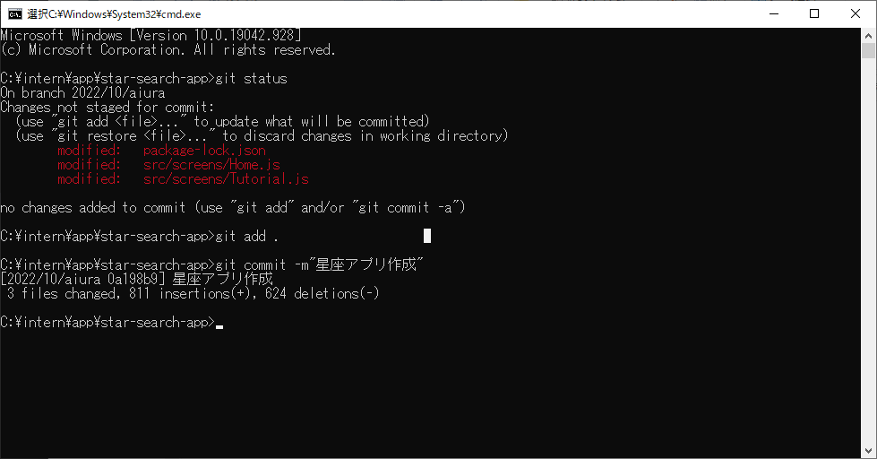

---
hide:
  - toc
---
# <i class="fa fa-arrow-circle-right" aria-hidden="true"></i> コードレビュー

## 3. ステージングしたコードをコミットしよう

!!! Note
    コミットとは、ファイルやディレクトリの追加・変更を記録することです。

```
$ git commit -m"{自由にコメントしてください}"

例えば...
$ git commit -m"星座アプリ作成"
```

<a href="../../../images/コードレビュー/コードレビュー_03.png" data-lightbox="スクリーンショット">
    
</a>
