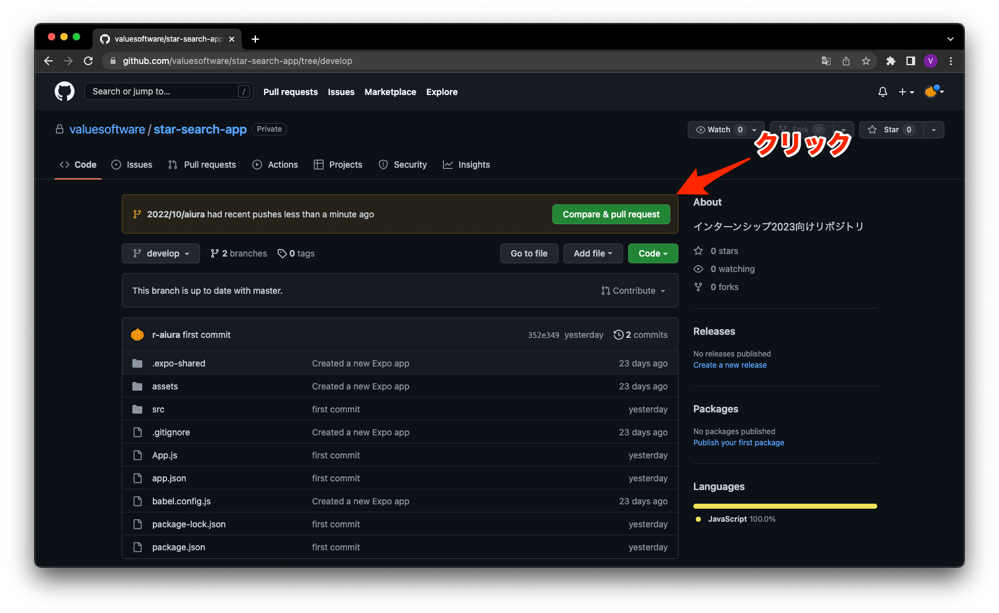
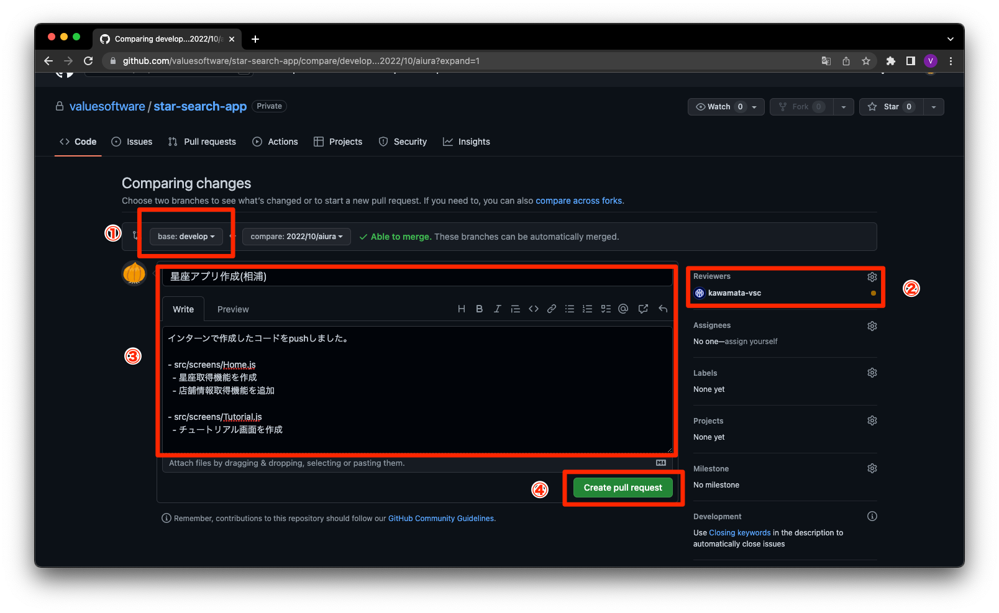

---
hide:
  - toc
---
# <i class="fa fa-arrow-circle-right" aria-hidden="true"></i> コードレビュー

## 5. pull requestしてみよう

  - Githubの、star-search-appリポジトリへ移動

  - 1.マージ先のブランチをdevelopに変更
  - 2.レビューしてもらうユーザを選択
    - kawamata-vscとr-aiuraを選択
  - 3.プルリクエストの内容を入力(中身は自由です)
  - 4.プルリクエストを行う

