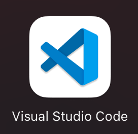
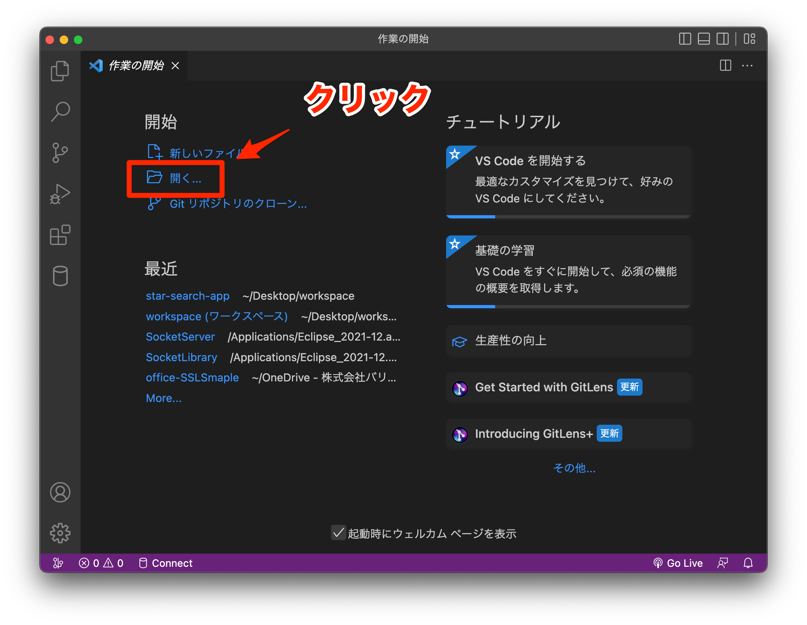
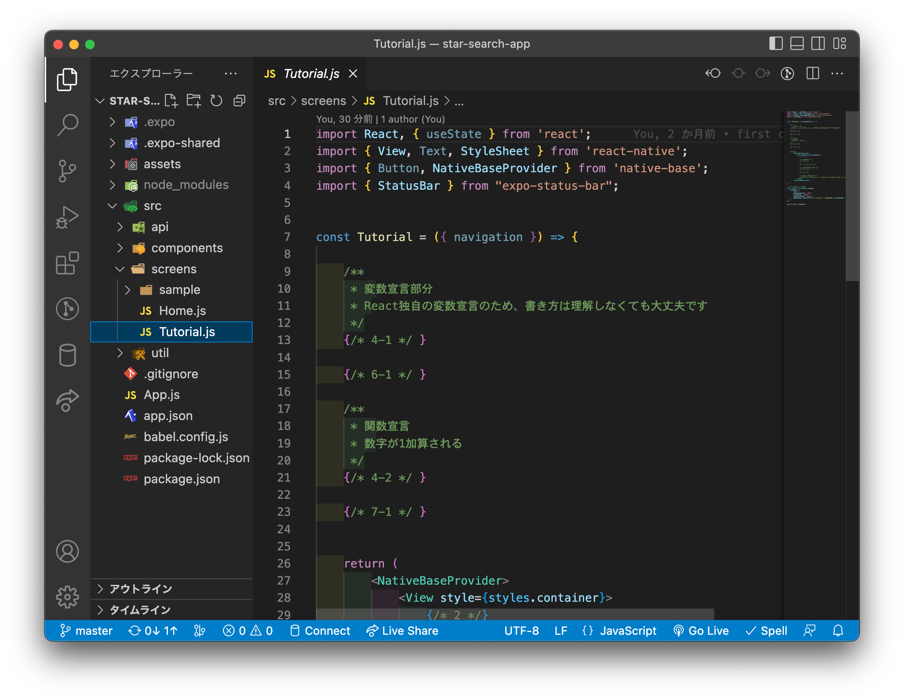

---
hide:
  - toc
---
# <i class="fa fa-arrow-circle-right" aria-hidden="true"></i> プログラミング基礎

## 1. VisualStudioCodeを起動
   
</img>

1. star-search-appフォルダを開く
    </img>

2. ~/src/screens/Tutorial.jsを開く
    </img>
