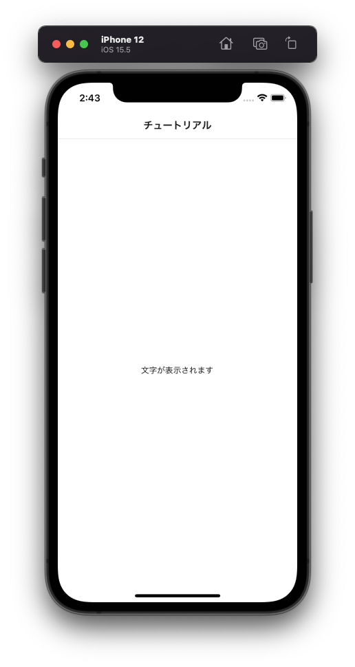

---
hide:
  - toc
---
# <i class="fa fa-arrow-circle-right" aria-hidden="true"></i> プログラミング基礎

## 2. 文字を表示してみよう

- 29行辺り: ``{/*  2 * /}``	← この下にコードを追加してください

        <Text>文字が表示されます</Text>

</img>

