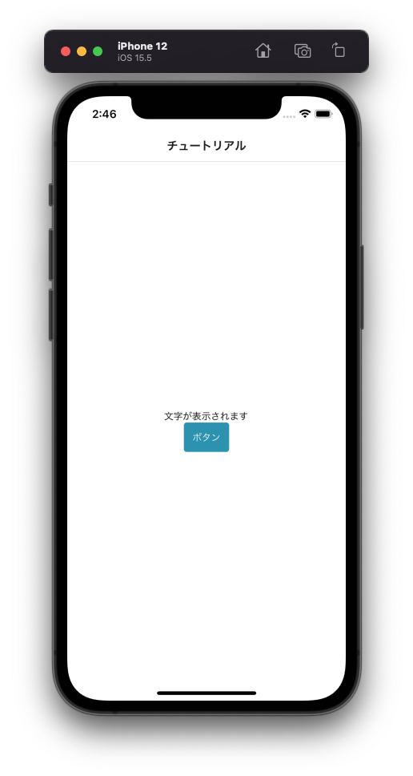

---
hide:
  - toc
---
# <i class="fa fa-arrow-circle-right" aria-hidden="true"></i> プログラミング基礎

## 3. ボタンを置いてみよう

- 35行辺り: ``{/* 3 */}{/* 4-4 */}``	← この下にコードを追加してください
  

        <Button>
          <ButtonText>ボタン</ButtonText>
        </Button>

</img>
