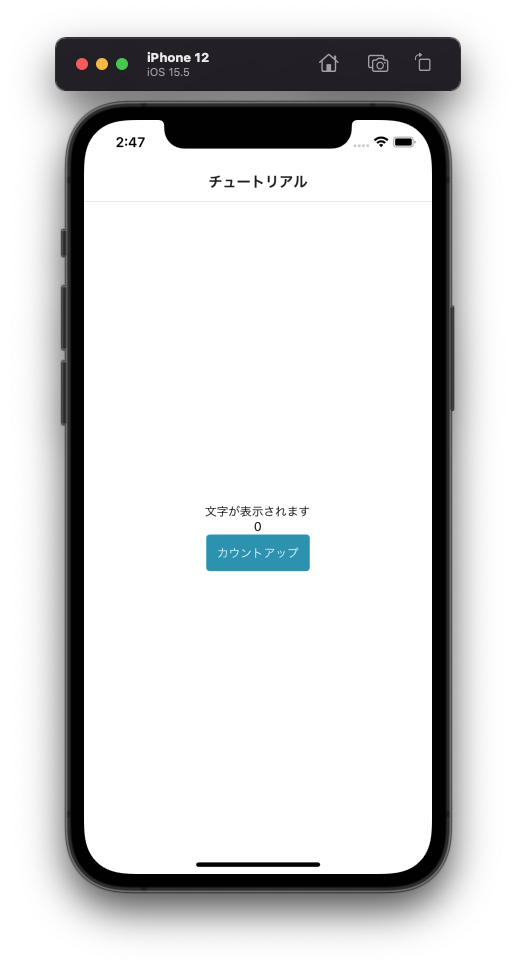

---
hide:
  - toc
---
# <i class="fa fa-arrow-circle-right" aria-hidden="true"></i> プログラミング基礎

## 4. ボタンを押すと数字カウントアップするように処理を追加してみよう

- 13行辺り: ``{/* 4-1 */}``	← この下にコードを追加してください
  

        // 数値型
        const [number,setNumber] = useState(0)

- 23行辺り: ``{/* 4-2 */}``	← この下にコードを追加してください
  

        const countUp = () => {

            {/* 5 */}
            // JavaScriptの基本の変数宣言
            let num = number + 1

            // 4-1の変数に代入
            setNumber(num)

            {/* 6-2 */}
            
        }

- 47行辺り: ``{/* 4-3 */}``	← この下にコードを追加してください
  

        <Text>{number}</Text>

- 50行辺り: ``{/* 3 */}{/* 4-4 */}``	← この下のコードを変更してください
  

        <Button onPress={() => countUp() }>カウントアップ</Button>

</img>

