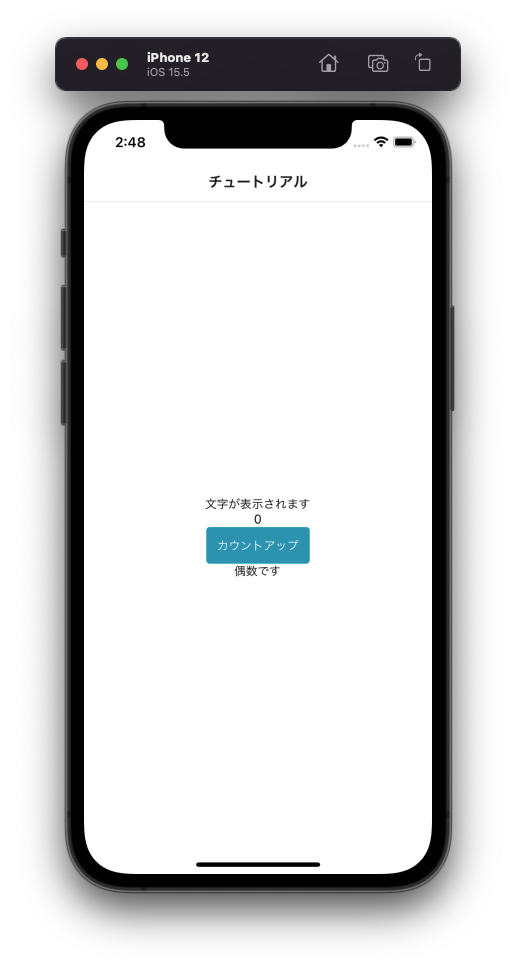

---
hide:
  - toc
---
# <i class="fa fa-arrow-circle-right" aria-hidden="true"></i> プログラミング基礎

## 6. 条件によって表示内容を変えてみよう(if文)

- 17行辺り: ``{/* 6-1 */}``	← この下にコードを追加してください
  

        // ブール型(真偽値)
        const [bool, setBool] = useState(true)

- 35行辺り: ``{/* 6-2 */}``	← この下にコードを追加してください
  
        // 分岐処理
        if (number % 2 == 0) {
            // 偶数の場合はfalse
            setBool(false)
        } else {
            // 奇数の場合はtrue
            setBool(true)
        }

- 64行辺り: ``{/* 6-3 */}``	← この下にコードを追加してください
  
        {/* 偶数の場合に表示する */}
        {  bool && 
            <Text>偶数です</Text>
        }

!!! Note
	if文は条件や値によって処理を分岐させ、一致する場合の処理と、一致しない場合の異なる処理を記述します。

	条件が一致する場合を「**真（true）**」、条件が一致しないことを「**偽（false）**」と言います。

		// 構文
		if (条件) {
			// 条件が真（true）であれば実行
		} else {
			//（false）であれば実行
		}

</img>
