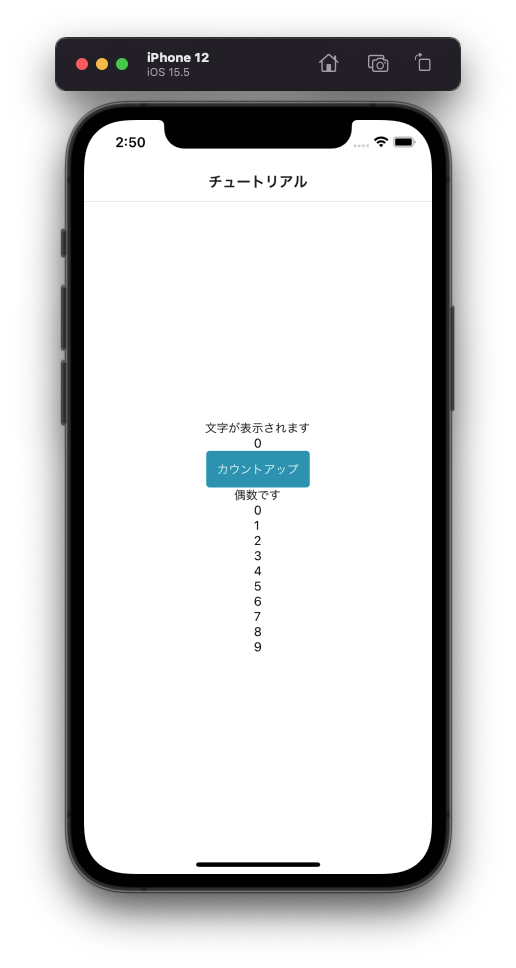

---
hide:
  - toc
---
# <i class="fa fa-arrow-circle-right" aria-hidden="true"></i> プログラミング基礎

## 7. 繰り返し処理をを行ってみよう(for文)

- 47行辺り: ``{/* 7-1 */}``	← この下にコードを追加してください
  
        const forText = () => {
            
            // 配列宣言
                let list = []

            // 10回繰り返す
            for(let i = 0; i < 10; i++) {
                // 配列に追加
                list.push(<Text>{i}</Text>)
            }

            // テキストを返す
            return(
                <View>
                    {list}
                </View>
                
            )
        }

- 89行辺り: ``{/* 7-2 */}``	← この下にコードを追加してください
  
        {/* 繰り返し処理 */}
        {forText()}

!!! Note
	for文は指定された回数だけ処理を繰り返します

		// 構文
		for (  初期値;  条件式;  増減値  ) {
 
		// 繰り返す処理を書く
		
		}

</img>

