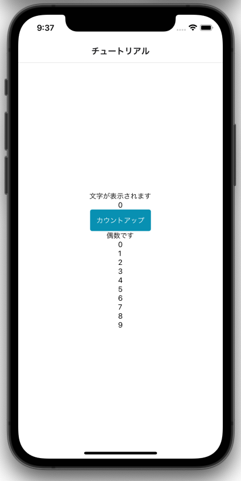

---
hide:
  - toc
---
# <i class="fa fa-arrow-circle-right" aria-hidden="true"></i> プログラミング基礎

## 8. 完成品サンプル

    import React, { useState } from 'react';
    import { View, Text, StyleSheet, Platform } from 'react-native';
    import { Button, NativeBaseProvider } from 'native-base';
    import { StatusBar } from "expo-status-bar";

    const Tutorial = ({ navigation }) => {

        /**
        * 変数宣言部分
        * React独自の変数宣言のため、書き方は理解しなくても大丈夫です
        */
        {/* 4-1 */ }
        // 数値型
        const [number,setNumber] = useState(0)

        {/* 6-1 */ }
        // ブール型(真偽値)
        const [bool, setBool] = useState(true)

        /**
        * 関数宣言
        * 数字が1加算される
        */
        {/* 4-2 */ }
        const countUp = () => {

            {/* 5 */}
            // JavaScriptの基本の変数宣言
            let num = number + 1
        
            // 4-1の変数に代入
            setNumber(num)
        
            {/* 6-2 */}
            // 分岐処理
            if (number % 2 == 0) {
                // 偶数の場合はfalse
                setBool(false)
            } else {
                // 奇数の場合はtrue
                setBool(true)
            }
        
        }
        
        {/* 7-1 */ }
        const forText = () => {

            // 配列宣言
                let list = []
        
            // 10回繰り返す
            for(let i = 0; i < 10; i++) {
                // 配列に追加
                list.push(<Text>{i}</Text>)
            }
        
            // テキストを返す
            return(
                <View>
                    {list}
                </View>
        
            )
        }

        return (
            <NativeBaseProvider>
                <View style={styles.container}>
                    {/* 2 */}
                    <Text>文字が表示されます</Text>

                    {/* 数値表示 */}
                    {/* 4-3 */}
                    <Text>{number}</Text>

                    {/* 3 */}{/* 4-4 */}
                    <Button onPress={() => countUp() }>カウントアップ</Button>

                    {/* JSXにおけるif文 */}
                    {/* 6-3 */}
                    {/* 偶数の場合に表示する */}
                    {  bool && 
                        <Text>偶数です</Text>
                    }

                    {/* 7-2 */}
                    {/* 繰り返し処理 */}
                    {forText()}

                    {/* 次の画面へ移動 */}
                    {/*<Button onPress={() => navigation.navigate('Home')} style={{marginTop:10}}>ボタン</Button>*/}
                </View>
            </NativeBaseProvider>
        )
    }

    // 見た目をカスタマイズ
    const styles = StyleSheet.create({
        container: {
            flex: 1,
            backgroundColor: '#fff',
            alignItems: 'center',
            justifyContent: 'center',
            paddingTop: Platform.OS === "android" ? StatusBar.currentHeight : 0
        }
    });

    export default Tutorial

</img>

