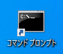
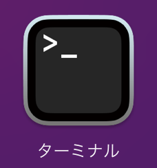

---
hide:
  - toc
---
#　<i class="fa fa-arrow-circle-right" aria-hidden="true"></i> 環境構築

## 1. 環境構築を行う際の注意点

!!! Warning

    下記の部分($)をコマンドプロンプトまたはターミナルに入力し実行します。

    Windowsの方はコマンドプロンプト、MacBookの方はターミナルを使用してください。

        $

!!! Note
    これからこのコマンドプロンプトを使用して環境構築を行っていきます。

    アプリ、システム開発においてコマンドプロンプト、ターミナルは欠かせない存在です
