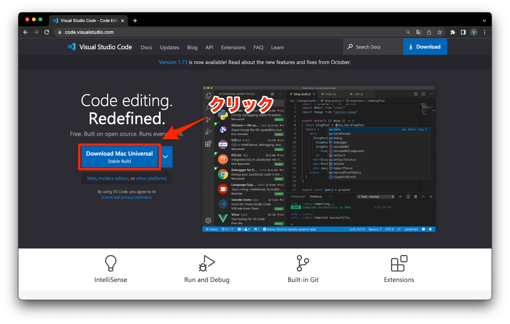

---
hide:
  - toc
---
#　<i class="fa fa-arrow-circle-right" aria-hidden="true"></i> 環境構築

## 2. VisualStudioCodeのインストール

1. [こちらからインストールを行う](https://code.visualstudio.com/)
   
    

2. インストーラー起動
   
    

3. インストール先指定
   
    

4. ショートカット作成
   
    

5. 追加タスク選択
   
    

6. インストール実行
   
    

7. インストール中
   
    

8. インストール完了
   
    

9.  Visual Studio Code起動
    
    
