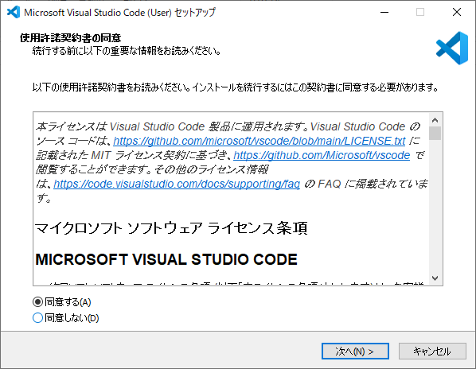
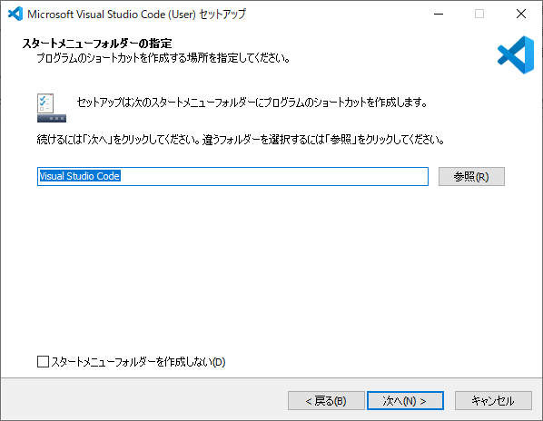
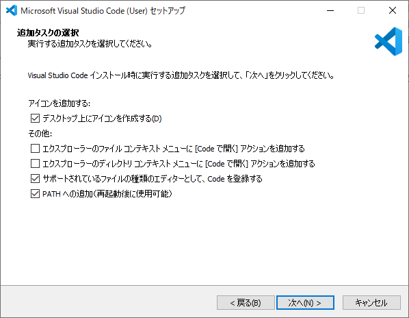
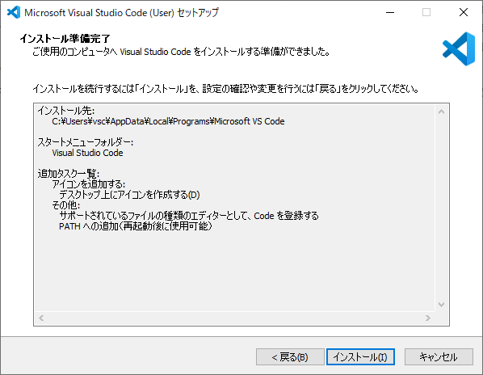
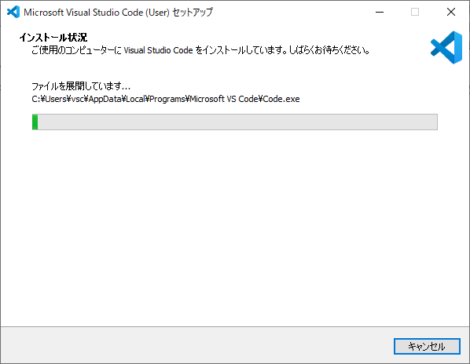
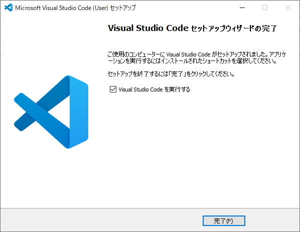
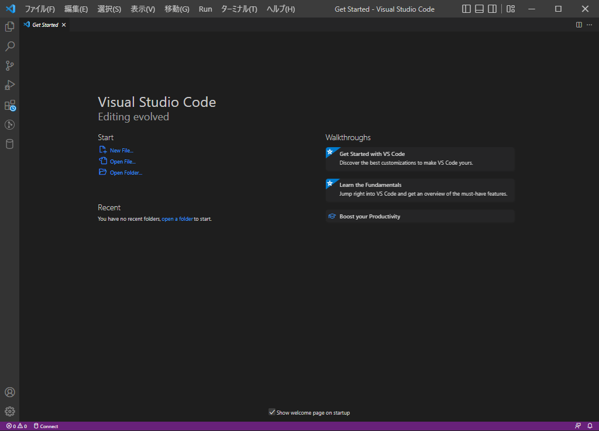

---
hide:
  - toc
---
#　<i class="fa fa-arrow-circle-right" aria-hidden="true"></i> 環境構築

!!! Note
    「Visual Studio Code」は、Microsoft社が開発・提供しているコードエディターのことです。 
    また、コードエディターには様々な種類がありますが、Visual Studio Codeの利点は、軽量で、機能が必要最低限に抑えられていることです。拡張機能が豊富なため、必要に応じて機能を追加し、最終的に自分好みのエディターに仕上げられることも大きなメリットです。

## 2. VisualStudioCodeのインストール

1. [こちらからインストールを行う](https://code.visualstudio.com/)
   
    

2. インストーラー起動
   
    

3. インストール先指定
   
    

4. ショートカット作成
   
    

5. 追加タスク選択
   
    

6. インストール実行
   
    

7. インストール中
   
    

8. インストール完了
   
    

9.  Visual Studio Code起動
    
    
