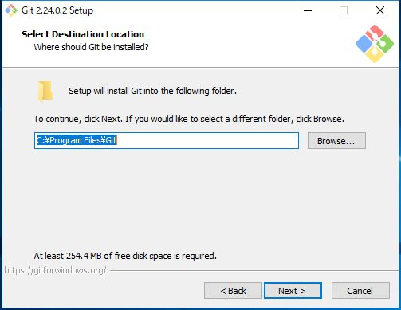
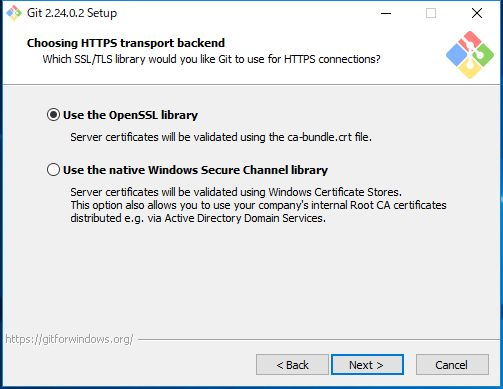
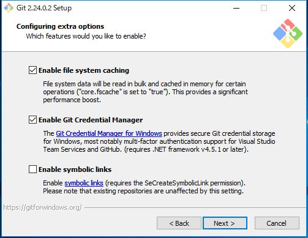
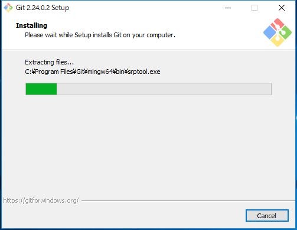
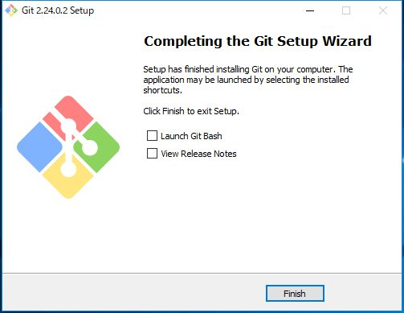
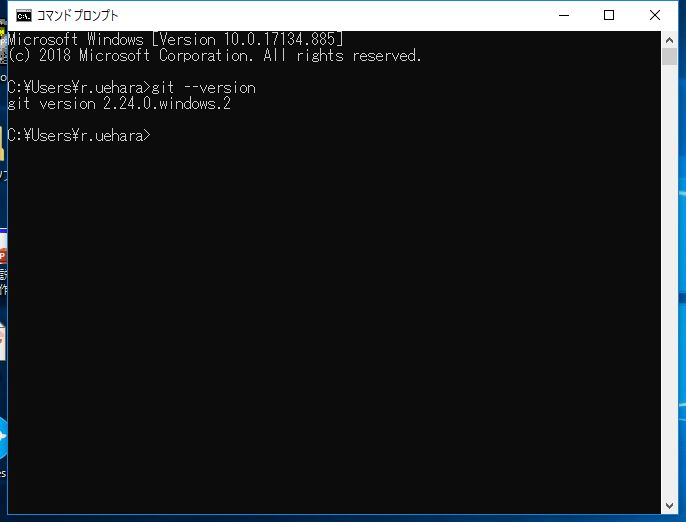

---
hide:
  - toc
---
#　<i class="fa fa-arrow-circle-right" aria-hidden="true"></i> 環境構築

## 3. Gitの設定
### 1. インストール※Windowsのみ

!!! Note
    Gitとは、ファイルのバージョン管理が簡単にできるツールです。 
    特徴は、「ファイルの変更履歴を管理」、「過去のファイルに戻せる」、「チームで共有できる」ことです。
    プログラマーにとっては、多くのコードを編集した上で何か不具合が起きたときに、元のバージョンへ戻すことはよくあることです。そういった際のファイルの管理を効率よく行えるのがGitです。
  

1. [ダウンロードを行う](https://gitforwindows.org/)

    

2. インストーラ実行 

    

1. インストーラ実行 
    
    

1. インストールディレクトリ選択 

    

1. インストールコンポーネント選択 

    

1. StartMenu設定 

    

1. デフォルトエディタを選択（ここではVSCを設定） 

    

1. ブランチ設定 

    

1. PATH環境を設定 

    

8. SSH接続の設定 

    

8. HTTPS接続の設定 

    

9. 改行コードの設定 

    

10. ターミナル・エミュレータの設定 

    

11. git pullの設定 

    

11. マネージャーの設定 

    

11. 拡張オプションの設定 

    

12. ベータ版機能の有効化設定 

    

1.  インストール中 
    
    

1.  完了 

    

1.  コマンドプロンプトから確認 

    

        $ git --version

### 2. アカウント設定を行う

    $ git config --global user.name "i-r.aiura-vsc"
    
    $ git config --global user.email "i-r.aiura@valuenet.co.jp"
