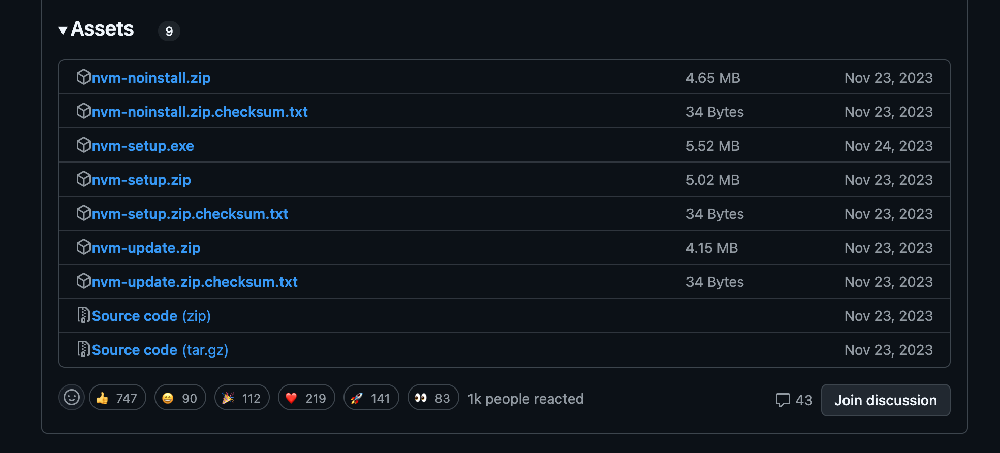
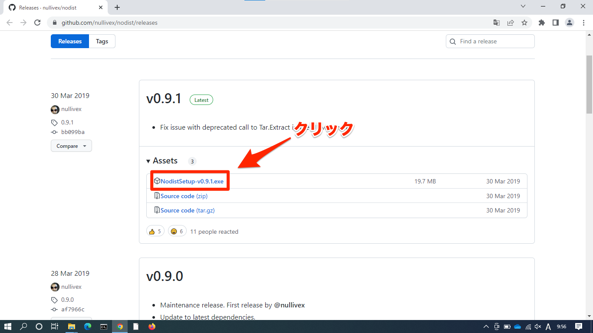
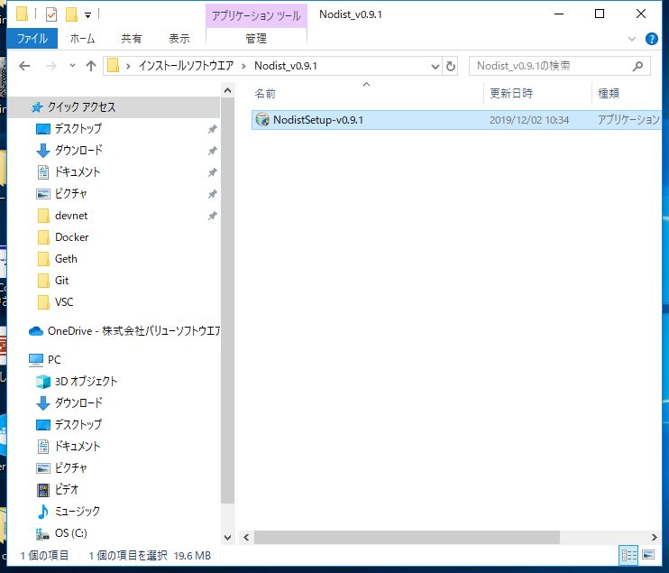
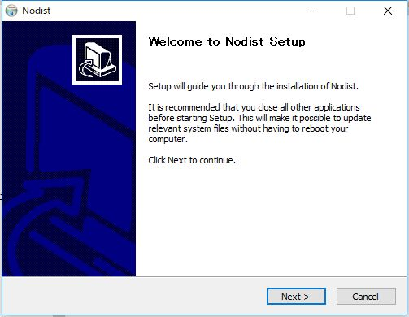
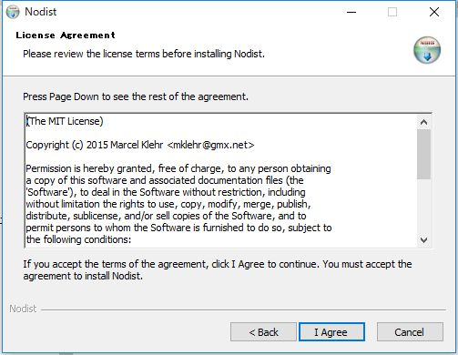
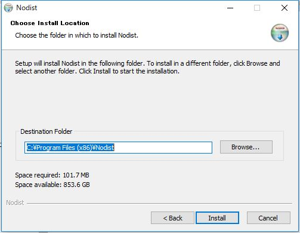
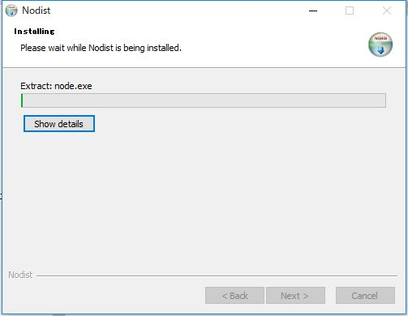
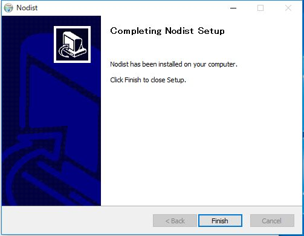

---
hide:
  - toc
---
#　<i class="fa fa-arrow-circle-right" aria-hidden="true"></i> 環境構築

## 4. npmのインストール

!!! Note
    Webページ作成などの際に使われるJavaScript言語の実行環境にNode.jsというものがあります。 このNode.jsの様々なプログラムを管理することができるのがnpmです。

### Windowsの場合
??? インストール方法-ExpoSDK52以降-
    1.[インストールを行う](https://github.com/coreybutler/nvm-windows/releases)

    - `nvm-setup.exe`をダウンロード

    

    2. ダウンロードした`nvm-setup.exe`を実行
    3. 特に項目を変えることなくインストールを続行
    4. インストール可能なものを調べる(次にインストールするnodeのバージョンが含まれていればOK) 

            $ nvm list available

    5. nodeをインストール

            $ nvm install 18.20.5

    6. nodeのバージョンを切り替える

            $ nvm use 18.20.5

    7. インストールされたnodeとnpmのバージョンを確認する(以下のバージョンが表示されていればOK)

            $ node -v

            18.20.5

            $ npm -v

            10.8.2

??? インストール方法-ExpoSDK51以前-
    1.[インストールを行う](https://github.com/nullivex/nodist/releases)

    
    
    2.インストーラ実行 
    

    2.インストーラ起動 
    

    3.利用規約を許諾 
    

    4.インストールフォルダを選択 
    

    5.インストール中 
    

    6.完了 
    

    ・コマンドプロンプトからNodistのインストールを確認 ※表示されない場合は、一度ウインドウを閉じて再実行してください 

        $ nodist -v
        0.9.1

    ・指定のNode.jsバージョンを取得しインストール 

        $ nodist + 16.13.2
        $ nodist 16.13.2

    ・インストールされたNode.jsとNPMのバージョンを確認する 

        $ node -v
        v16.13.2
        $ npm -v
        8.1.2

    ・npxをインストール

        $ npm install npx -g

    - 以下は、すでに古いnodeのバージョンが入っている場合の手順

        - 指定のNode.jsバージョンを取得しインストール 

                $ nodist + 16.13.2
                
                $ nodist 16.13.2

        - インストールしたnodeのバージョンに合わせてnpmをバージョンアップ 

                $ nodist npm match

        - インストールされたNode.jsとNPMのバージョンを確認する 

                $ node -v
                v16.13.2
                $ npm -v
                8.1.2

        - npxをインストール

                $ npm install npx -g

    

### MacBookの場合
??? インストール方法
        
    * * *

    1.nodebrewをインストール

        $ brew install nodebrew

    * * *

    2.インストールしたnodebrewのバージョンを確認。バージョンが確認できればOK
    
        $ nodebrew -v

        nodebrew 1.0.1
        ~

    * * *

    3.nodeをインストールを

        $ nodebrew install-binary v14.3.0

    * * *

    4.使用するnodeのバージョンを設定

        $ nodebrew use v14.3.0

    * * *

    5.nodeにパスを通す

        $ echo 'export PATH=$HOME/.nodebrew/current/bin:$PATH' >> ~/.zprofile
        $ source ~/.zprofile

    * * *

    6.`npm -v`を実行しバージョンを確認。`v14.3.0`と表示されていればOK

        $ npm -v

        v14.3.0
