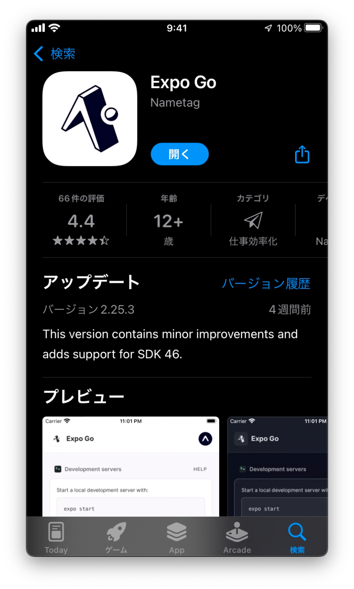

---
hide:
  - toc
---
#　<i class="fa fa-arrow-circle-right" aria-hidden="true"></i> 環境構築

## 9. Expo Goのインストール

!!! Note
    Expo GoとはExpoで開発したアプリケーションをスマートフォンで動作確認を行うことができるアプリケーションです。

### 1. アプリストアから`Expo Go`をインストール

   
